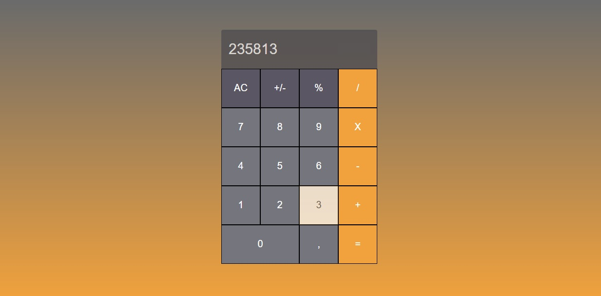

# projeto-calculadora

> O objetivo desse projeto foi mostrar o recurso CSS grid, os recursos de classes no html e functions do JavaScript. Além disso, há duas versões do grid CSS onde a última ficou com o código mais limpo.

### Ajustes e melhorias

As próximas atualizações serão voltadas nas seguintes tarefas:

- [ ] Tarefa 1 ativar o botão de porcentagem
- [ ] Tarefa 2 tornar responsivo

## 🤝 Colaboradores

Agradecemos às seguintes pessoas que contribuíram para este projeto:

<table>
  <tr>
    <td align="center">
      <a href="https://www.linkedin.com/in/anderson-oliva/">
         
        
          <b>Anderson Oliva</b>
        
      </a>
    </td>
    <td align="center">
      <a href="https://www.linkedin.com/in/rodolfomori/">
         
        
          <b>Rodolfo Mori</b>
        
      </a>
    </td>
    
</table>

